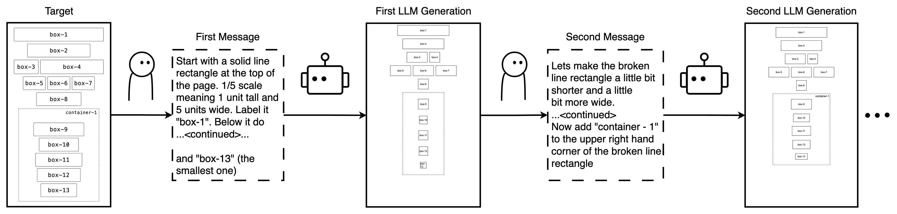
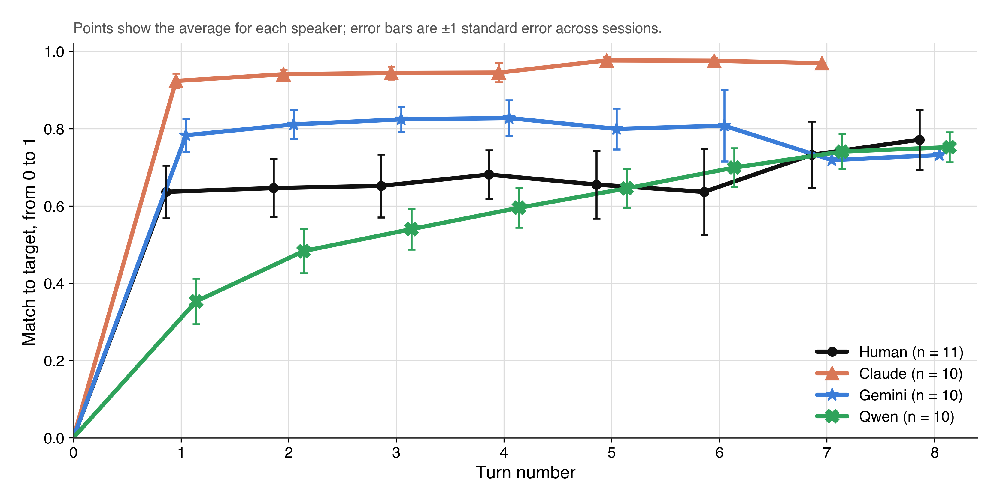

# Reiterative Layout Generation (RLG)

Data, code, and analysis behind **"Measuring Human-AI and AI-AI Teams in
Multi-turn Layout Creation."** The study measures how well a fixed "builder"
model can regenerate a target webpage layout over several turns of natural-language instructions, when those instructions come from a real person, from
another AI model standing in for one, or from that same AI model under
different instruction styles.



**[Browse the data →](https://virdirajvir.github.io/RLG/)** — every session in
the study, rendered: the reference each one was given, the instructions as
typed, each page as it was generated, and the preference judgments the scoring
metric was fitted from. Built from this repository by
[`.github/workflows/pages.yml`](.github/workflows/pages.yml) on every push to
`main`, so the site and the code here cannot drift apart.

## Experiment Summary

Every session starts from a hidden reference wireframe. A **builder model**
(Claude Opus 4.8, fixed across every condition) generates a full HTML page
from scratch each turn, based only on the current natural language instruction. A **speaker**, a real person or another AI model,
sees the reference and the builder's latest attempt (a generation), and writes the next
instruction to close the gap. This repeats for several turns. Every generated
page is scored against its reference by a geometric similarity metric fitted
from real human pairwise preference judgments (see [Metric](#metric-fitting-prefelic)
below). The three speaker conditions this produces are:

| Condition | Speaker | Where |
|---|---|---|
| **H2A** (human-to-AI) | A real Prolific participant, typing instructions themselves | `application/`, live Prolific-facing app |
| **A2A** (AI-to-AI) | Claude Opus 5, Gemini 3 Flash, or Qwen2.5-VL-72B, each prompted to play the speaker role | `a2a/` |
| **Claude Ablations** | Claude Opus 5 again, under 6 different instruction-style constraints (see table below), isolating *why* it converges faster than the other two models | `a2a/` (same pipeline, extra `DRIVER_MODELS`/turn-budget runs) |

A fourth, structurally separate study, **Prefelic** (preference elicitation), collects the pairwise human judgments the similarity metric itself is fit
from. This sub-study allows us to measure trajectories of generations with a interpretable and human-preference based metric.


## Data collected

| | Count | Notes |
|---|---|---|
| H2A participants | 6 (of 8 recruited) | 2 excluded by the same `k≥2` qualifying filter `paper/scripts/data.py` applies — a session that never matched ≥2 boxes never produced a usable page |
| H2A qualifying sessions | 11 | up to 2 sessions/participant, 10-minute timer each |
| A2A base sessions | 30 | 10 sessions × 3 models (Claude uncapped, Gemini, Qwen), speaking freely |
| Claude ablation sessions | 45 | 10 sessions × 5 more instruction-style conditions (see below) |
| Scored references | 5 + 1 practice | `darkminimal`, `midcentury`, `retro`, `steel`, `stickynotes` (+ `apothecary`, tutorial-only) |
| Prefelic raters | 19 (19/19 passed gold QC) | real Prolific participants, real-vs-broken attention checks |
| Prefelic judgments | 1,029 total / 718 decisive | non-tie, non-gold comparisons used to fit the metric |

**The 6 Claude conditions** (base + 5 ablations, all against the same fixed
builder and reference set):

| Condition | What changes |
|---|---|
| `claude_uncapped` | speaking freely, no constraints — the base comparison condition |
| `claude_capped` | instructions limited to a short length each turn |
| `claude_no_thinking` | extended thinking turned off |
| `claude_element_cap` | capped at 4 distinct labeled elements per instruction |
| `claude_human_style` | few-shot prompted toward how real participants phrase instructions |
| `claude_human_style_no_numbers` | human-style, additionally forbidden from giving exact element counts |

## Results

Computed directly from `analysis/prefelic_refit/weights_final.csv` and the
feature CSVs in `analysis/A2A_analysis/`, the same way `paper/scripts/data.py`
does — mean score (0-1) on each session's **final turn**:

| Condition | Mean final-turn score | Sessions |
|---|---:|---:|
| **Human (H2A)** | **0.749** | 11 |
| Claude, speaking freely | 0.932 | 10 |
| Gemini | 0.841 | 10 |
| Qwen | 0.828 | 10 |
| Claude, human-style few-shot | 0.935 | 10 |
| Claude, short instructions only | 0.933 | 10 |
| Claude, 4 elements per turn max | 0.930 | 10 |
| Claude, thinking turned off | 0.927 | 10 |
| Claude, human-style + no exact numbers | 0.905 | 5 |


Every AI condition outperforms real human participants on final-turn score.




### Metric fitting (Prefelic)

The similarity score above comes from a Bradley-Terry preference model fit on
the 718 decisive Prefelic judgments, reduced from an original 11 geometric
features to **5** after correlation pruning (train-only, re-validated
identical across all 5 CV folds):

| Feature | Coefficient | Significant? |
|---|---:|:---:|
| `f1_recall` (did it reproduce the content) | +4.59 | ✅ |
| `f8_aspect` (box aspect ratio match) | +1.62 | ✅ |
| `f9_order_consistency` (reading order) | +0.70 | ✅ |
| `f14_section_uniformity` | −0.40 | ✅ |
| `f7_rel_height` | −0.00 | not significant, kept for completeness |

Cross-validated (leave-one-rater-out) accuracy: **0.883**, vs. a 0.758
majority-class baseline. Full derivation in
`analysis/prefelic_refit/findings_summary.md`.

## Repository structure

```
.
├── README.md
│
├── a2a/                            AI-to-AI session driver — one AI model (Claude, Gemini, or
│   │                               Qwen) as the "speaker" against the fixed builder model.
│   ├── config.py                      builder model + the 3 driver models
│   ├── driver.py                      runs one A2A session, turn by turn
│   ├── generator.py, renderer.py      builder-side generation + HTML rendering
│   ├── graph.py / graph.png           session state-machine diagram (LangGraph)
│   ├── references.py, store.py        reference loading, Supabase writes
│   ├── run_a2a_study.py               batch-runs the 3 base conditions
│   ├── run_element_cap_ablation.sh    batch-runs the element-cap Claude ablation
│   ├── run_human_style_ablation.sh    batch-runs the 2 human-style Claude ablations
│   ├── reference_branch_sweep.py      counterfactual "different speaker, same
│   │                                   trajectory" sweep — feeds fig11-12
│   └── branch_test.py                 single-turn counterfactual — feeds fig10
│
├── analysis/                       Feature/judgment CSVs and the scripts that fit and
│   │                               validate the similarity metric.
│   ├── features-final.json            the final 11-feature set (φ vector) the metric is built from
│   ├── A2A_analysis/
│   │   ├── a2a/
│   │   │   └── features_a2a.csv           per-turn geometric features, every A2A + Claude-ablation session
│   │   └── prolific/
│   │       └── features_prolific.csv      per-turn geometric features, every H2A (Prolific) session
│   └── prefelic_refit/
│       ├── judgments.csv                  raw Prefelic preference judgments (the calibration data)
│       ├── features.csv                   geometric features for every judged candidate pair
│       ├── weights_final.csv              the fitted coefficients paper/ actually reads
│       ├── refit_prefelic.py              base fit — gold QC, agreement, Bradley-Terry weights
│       ├── refit_prefelic_holdout.py      80/20 holdout validation
│       ├── refit_prefelic_cv.py           5-fold cross-validation
│       ├── refit_prefelic_final.py        final restricted 5-feature refit → weights_final.csv
│       └── *-report.md                    one write-up per script above
│
├── application/                    The live Prolific-facing web app — see Architecture below.
│   ├── api/                           Vercel serverless functions — the real backend
│   │   ├── chat.js                        a generation turn: calls the builder model, scores the result
│   │   ├── evaluation.js                  box extraction + scoring, shared with a2a/ and data_pipeline/
│   │   ├── prolific-claim.js              claim a round-robin study slot
│   │   ├── prolific-state.js              read current stage/session
│   │   ├── prolific-advance-stage.js      advance instructions→tutorial→session→survey→done
│   │   ├── prolific-verify.js, -history.js, -test-reset.js
│   │   └── _lib/                          shared helpers (+ their tests)
│   ├── frontend/                      React 19 SPA
│   │   └── src/
│   │       ├── App.jsx                    auth/session management, layout
│   │       ├── components/                free-roam chat UI (Auth, ChatInterface, Sidebar)
│   │       │   └── prolific/                  the h2a generation-study screens: Consent,
│   │       │                                  Instructions, TutorialGuide/Practice, the
│   │       │                                  session itself (ReferencePanel), Survey, Outcome
│   │       ├── study/                     the Prefelic (binary preference) study's own
│   │       │                              data/fixtures — studyData.js, studyFixture.js
│   │       ├── explore/                   the published data explorer — layout-gen
│   │       │                              (human + unrestricted AI sessions),
│   │       │                              claude-ablations, prefelic
│   │       ├── explore-main.jsx           its entry point: renders explore/ alone, with
│   │       │                              no Supabase or API dependency, which is what
│   │       │                              lets it build and run from this repo
│   │       └── explore-data/              the JSON explore/ reads — built by
│   │                                      paper/scripts/explorer_export/
│   ├── schema.sql                     chat app tables (conversations, messages)
│   └── study_schema.sql               study tables (study_references/candidates/pairs,
│                                       judgments, study_participants, survey_responses) +
│                                       every RPC the app calls
│
├── data_pipeline/                  Node scripts that turn raw Supabase rows into the CSVs
│   │                               analysis/ consumes.
│   ├── references.js                  the 6 wireframe prompt ladders (trimmed from an original 16)
│   ├── generate.js                    runs the prompt ladders, seeds study_candidates/study_pairs
│   ├── features_a2a.js                geometric feature extraction — A2A + Claude ablations
│   ├── features_prolific.js           geometric feature extraction — H2A
│   ├── export-judgments.js            judgments → analysis/prefelic_refit/judgments.csv
│   ├── ingest-candidates.js           messages → study_candidates/study_pairs
│   ├── prefelic_refit_export.mjs      exports the two CSVs refit_prefelic.py needs
│   ├── token_stats_h2a.js             prompt token-count diagnostics
│   └── _verify-ingest.js, _inspect-judgments.js, _backup-judgments.js   diagnostics
│
├── paper/                          The paper itself.
│   ├── scripts/                       one script per figure, all sharing data.py's logic
│   │   ├── data.py                        shared load_all() — reads the fitted weights + both
│   │   │                                  feature CSVs, applies the k≥2 qualifying filter,
│   │   │                                  labels every row's condition
│   │   ├── style.py                       shared colors/fonts across every figure
│   │   ├── fig1_human_vs_ai_by_model.py, fig3_three_claude_vs_human.py,
│   │   │   fig9_claude_four_conditions_vs_human.py, fig6_prompt_type_analysis.py,
│   │   │   fig8_all_conditions_h2a_vs_a2a.py, fig10-13, fig_fewshot_*.py, ...
│   │   └── explorer_export/export.py      builds application/frontend/src/explore-data/*.json
│   ├── data/                          intermediate CSVs each fig script needs (chars-per-turn,
│   │                                  branch-sweep results, manual labeling sets, ...)
│   └── figs/                          every rendered figure (28 PNGs)
│
└── references/                     The 6 wireframe HTML targets actually used.
    ├── darkminimal-, midcentury-, retro-, steel-, stickynotes-wireframe.html
    │                                    the 5 scored study references
    └── apothecary-wireframe.html        practice/tutorial reference, excluded from scoring
```


## Application architecture

The Prolific-facing app is a single React SPA with a Node/Express dev proxy
in front of the real backend (Vercel serverless functions):

```
Prolific participant
        │  (?PROLIFIC_PID=...&STUDY_ID=...&SESSION_ID=...)
        ▼
┌─────────────────────────────────────────────────────────┐
│  application/frontend  (React 19 SPA)                    │
│                                                            │
│  ConsentScreen → Instructions → Tutorial (practice ref)   │
│       → Session 1 → Session 2 → Survey → Outcome           │
│                                                            │
│  each Session:  ChatInterface + ReferencePanel            │
│    (participant sees the reference + latest generation,   │
│     types the next instruction, repeats for up to 10 min) │
└───────────────────────┬────────────────────────────────────┘
                         │ fetch /api/*
                         ▼
┌─────────────────────────────────────────────────────────┐
│  application/api  (Vercel serverless functions)           │
│    chat.js                  — generation turn (calls the  │
│                                 builder model via          │
│                                 OpenRouter, scores the      │
│                                 result via evaluation.js)   │
│    prolific-claim.js        — claim a round-robin slot     │
│    prolific-state.js        — read current stage/session   │
│    prolific-advance-stage.js — advance instructions→        │
│                                 tutorial→session→survey→done│
│    prolific-verify.js / -history.js / -test-reset.js       │
└───────────────────────┬────────────────────────────────────┘
                         │ service-role client
                         ▼
┌─────────────────────────────────────────────────────────┐
│  Supabase (Postgres + RLS)                                │
│    conversations / messages        — every generation turn │
│    study_references/candidates/pairs, judgments — Prefelic │
│    study_participants, survey_responses          — H2A     │
│    every RPC in application/study_schema.sql               │
│    (round-robin slot assignment, stage advancement,        │
│     admin dashboards — all SECURITY DEFINER, JWT-gated)    │
└─────────────────────────────────────────────────────────┘
```

`application/dev-server.js` is a thin local Express wrapper around the same
`api/*.js` handlers for `node dev-server.js` local development — production
runs the handlers directly as Vercel functions.

`data_pipeline/` and `a2a/` talk to the same Supabase project directly with
the service-role key (bypassing RLS) — they're offline batch tooling, not
part of the request path above.

## Running this locally

```bash
# Frontend + local API (application/)
cd application && node dev-server.js        # terminal 1, port 3001
cd application/frontend && npm install && npm run dev   # terminal 2, port 5173

# Re-run the analysis pipeline (requires python3.10 + numpy/pandas/scipy/matplotlib)
python3.10 analysis/prefelic_refit/refit_prefelic_final.py   # refit the metric weights
python3.10 paper/scripts/fig1_human_vs_ai_by_model.py         # regenerate a figure
```

Supabase credentials are required for anything that talks to the database
(`application/`, `a2a/`, `data_pipeline/`) — none are included in this repo;
see each directory's `.env.example`.

## Reproducibility notes

- CSVs directly under `analysis/` (`weights_final.csv`, `judgments.csv`,
  `features.csv`, the two `features_*.csv` under `A2A_analysis/`) are
  normally regenerable from Supabase but are **included as checked-in
  snapshots** so `paper/scripts/*.py` runs without database access.
- `analysis/A2A_analysis/{a2a,prolific}/shots/` (raw per-generation
  screenshots) are **not** included, they're only needed to regenerate
  `fig2_gallery.py` and `fig13_all_references_row.py` from scratch; both
  figures' rendered output is already in `paper/figs/`.

## License

[MIT](LICENSE) for the code. The study data under `paper/data/`,
`analysis/`, and `application/frontend/src/explore-data/` is released
alongside it for research use; please cite the paper if you build on it.
